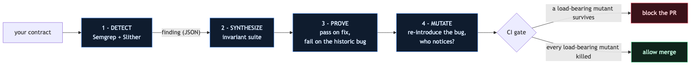

# InflationGuard

Catches the donation / rounding share-inflation bug class before it ships. This is the pattern behind zkLend (~ $9.5M, Feb 2025), Resupply (~ $9.56M, Jun 2025), Sonne, Hundred, and Onyx — the same root cause surfacing at a different layer each time.

I didn't pick one exploit. I picked the pattern that keeps producing them, reproduced two of its most recent instances as runnable Foundry PoCs, and built a four-stage tool that flags it statically, auto-generates the property test that would have caught it, proves that test passes on the fix and fails on the bug, and then uses mutation testing to confirm the fix is actually exercised.

```bash
bash tool/run.sh
```



---

## Results

| Stage | What it shows | Evidence |
|---|---|---|
| **Exploit** | ~2,000-token donation drains a 1,000,000 reserve; first depositor steals the next user's deposit | `forge test` 5/5 |
| **Detect** | Semgrep + Slither flag only the vulnerable contracts — 4 HIGH + 1 MED, 0 false positives | `make detect` |
| **Synthesize** | The finding becomes a 3-property Foundry invariant suite, automatically | `make synth` |
| **Prove** | Generated invariant passes on the fix (16,384 calls × 3), fails on the historic bug | `make invariant` / `make invariant-vuln` |
| **Mutate** | Happy-path tests kill 0/2 load-bearing mutants; InflationGuard kills 2/2 | `make mutate` |

---

## The bug

The same rounding/donation share-inflation pattern has surfaced across chains, in audited code, multiple times in 18 months:

| Incident | When | Loss | Root cause |
|---|---|---|---|
| **zkLend** (Starknet) | Feb 2025 | ~$9.5M | Accumulator inflated by donation; symmetric floor on the burn |
| **Resupply** (Ethereum) | Jun 2025 | ~$9.56M | `1e36 / price` floors to 0, disabling the LTV check |
| Sonne / Hundred / Onyx | 2023-24 | ~$35M combined | Classic empty-market donation; real deposit floors to 0 shares |

The common property: a security-relevant value produced by truncating integer division, where the divisor is attacker-movable (a donatable balance, no virtual-shares floor), and the rounding direction benefits the attacker.

Slither, Mythril, and Aderyn don't catch it because integer truncation is correct EVM behavior. The bug lives one level up, at protocol semantics.

---

## How to run

Requires Foundry, Python 3.10+. `forge-std` is vendored so the repo is self-contained. For the detect stage: `pip install semgrep slither-analyzer`.

```bash
bash tool/run.sh          # full pipeline, narrated

# or by stage:
make exploit              # reproduce both PoCs, show the fix blocks them
make detect               # Semgrep + Slither on src/
make synth                # regenerate the invariant suite from the finding
make invariant            # prove it passes on the fix
make invariant-vuln       # prove it fails on the bug
make mutate               # mutation gate
make test                 # all Foundry tests
```

---

## Repo layout

```
src/
  vulnerable/   VulnerableVault.sol          Face A: first-depositor theft (ERC-4626 shape)
                VulnerableLendingMarket.sol  Face B: Resupply 1e36/price floors to 0
  safe/         SafeVault.sol               internal accounting + virtual shares + guard
                SafeLendingMarket.sol       require(rate > 0) + non-manipulable pricing
test/
  Exploit.t.sol                             PoCs: exploit on vuln, blocked on fix
  NaiveHappyPath.t.sol                      the deceptive "100% coverage" tests
  generated/InflationGuardVaultInvariant.t.sol   emitted by the synthesizer
tool/
  inflationguard/
    inflationguard_slither.py               semantic detector (Slither AST/IR)
    semgrep/inflationguard.yml              syntactic detector (Semgrep)
    synthesize_invariant.py                 invariant generator
  mutation/mutate.py                        mutation gate
  run.sh                                    one-command pipeline
.github/workflows/inflationguard.yml        CI gate
```

---

## Limitations

The detectors are heuristic — truncation is legal. The synthesize → prove → mutate stages auto-triage false positives: a flagged contract whose invariant passes is a non-issue. The synthesizer currently covers the share-vault face; the lending-pair invariant (for the Resupply shape) and a Cairo backend are the obvious next increments.
